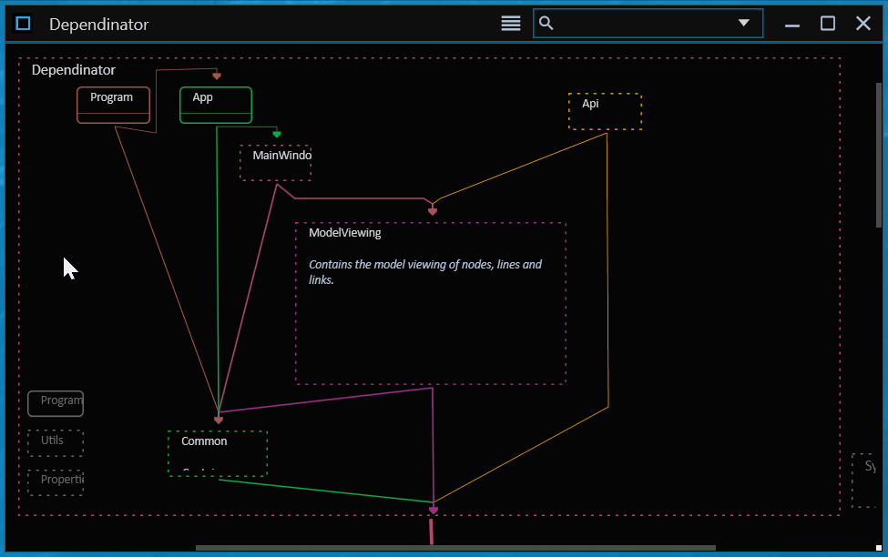
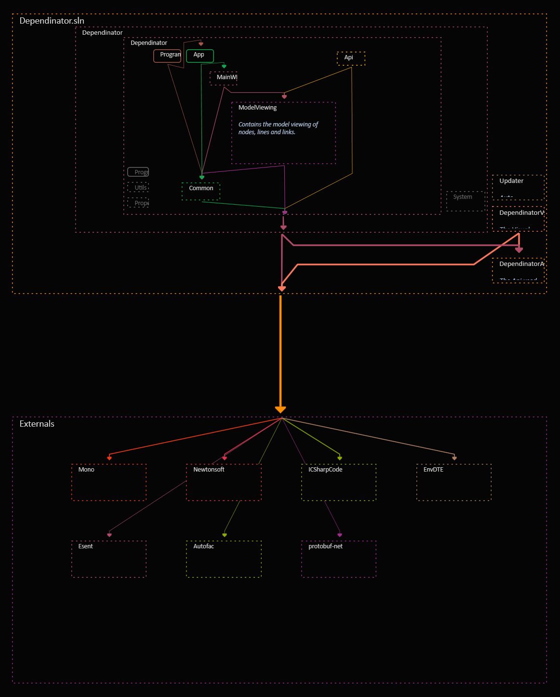
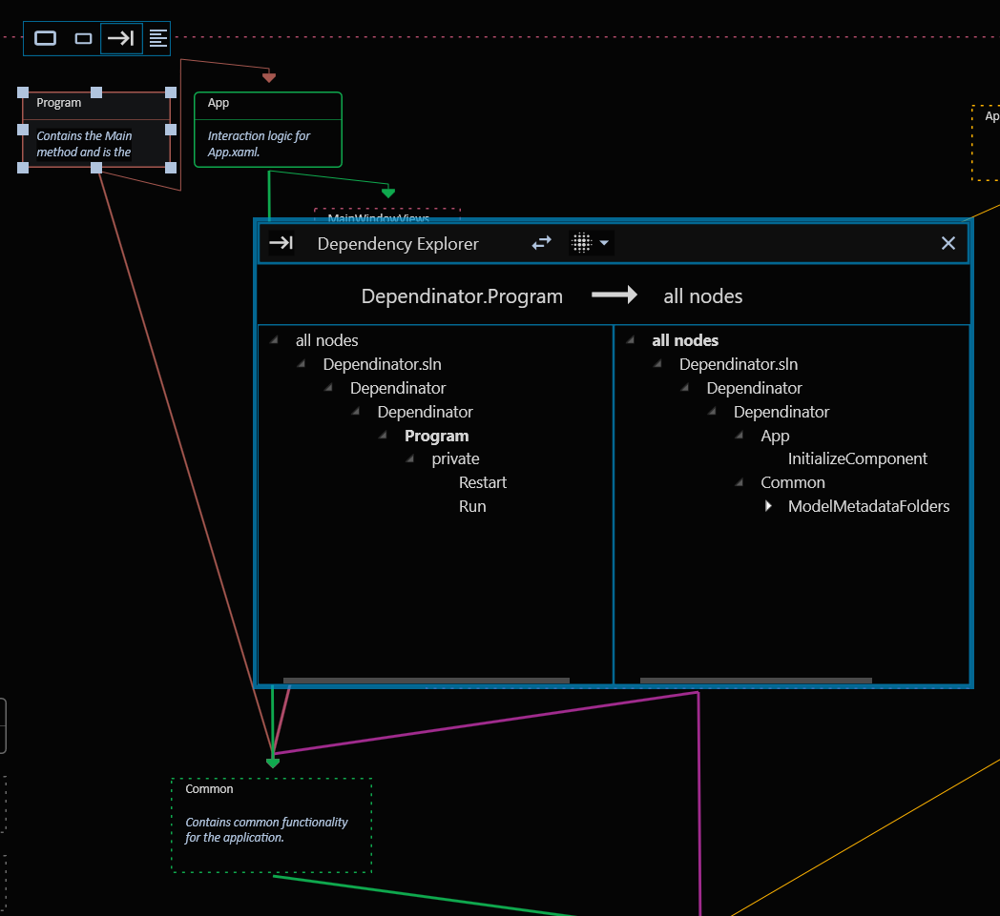
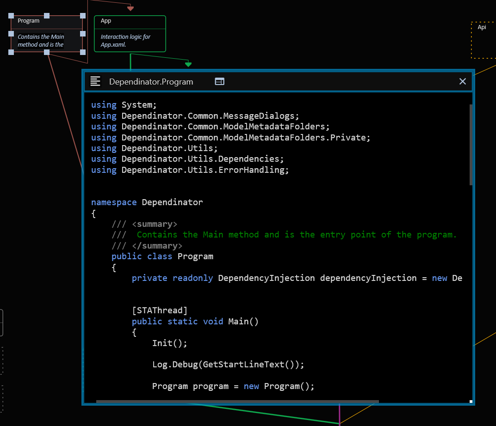

#  Dependinator

Dependinator visualizes code structure and dependencies in a map-like interface to make it easier to understand and refactor the architecture. Dependinator also provides functionality to explore these dependencies and make it easy to jump from one part of the system to another and even dive into the code, inline, or open external code editor.

## Get Started

* **Download** Dependinator from the [latest release](https://github.com/michael-reichenauer/Dependinator/releases/latest).
* **More information** is available in the [documentation](https://github.com/michael-reichenauer/Dependinator/wiki/Dependinator-Help).

An example project is included in the application.

## About Dependinator

Dependinator parses a data source like e.g. a .NET solution with assemblies and creates a model, which is visualized as a map-like interface similar to e.g. Google maps. Dependinator also supports integration with third-party parsers like e.g. the [Dependinator Go parser](https://github.com/michael-reichenauer/depgoparser).

### The Model View

The first time, the view shows an overview of the top-level components and their references to external components. The user can then quickly zoom into the model to see more details within some node. All references from within one node to another are represented as one line.  

### Dependency Explorer

References and dependencies between different parts of the code can be explored in detail by using the Dependency Explorer window. It makes it easier to investigate exactly what type or member within a node has a reference to some other type/member within some other node.

### Source Code View

For types and members, it is possible to see the source code. Often, the actual source file can be shown and in some cases, Dependinator will show the decompiled code.

### Visual Studio Extension

The Dependinator Visual Studio Extension (installed by default) supports integration between Dependinator and Visual Studio (VS). In the model view, it is possible to open the source file for a node in VS, and in VS, it is possible to trigger Dependinator to pan and zoom to show the node that corresponds to the active window in VS.

