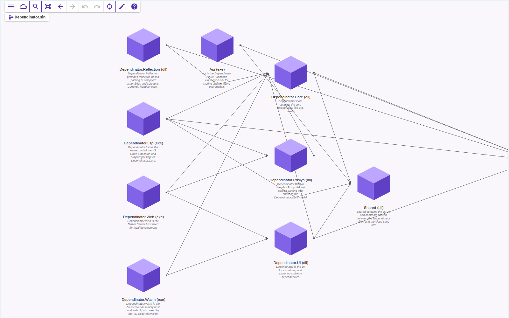
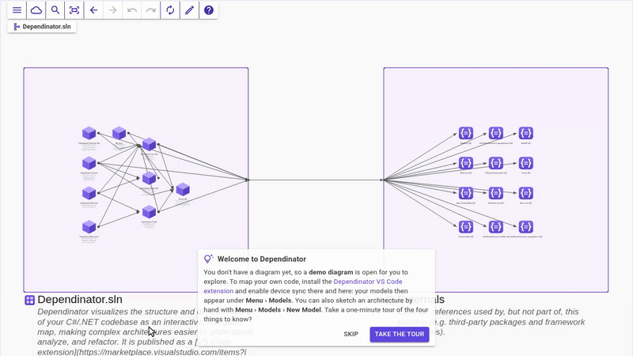

  

<h1 align="center">Dependinator</h1>

  See your C#/.NET codebase as an interactive dependency map, right inside VS Code.

  
  
  

  <a href="https://marketplace.visualstudio.com/items?itemName=michaelreichenauer.dependinator"><b>Install in VS Code</b></a>
  &nbsp;&middot;&nbsp;
  <a href="https://dependinator.com"><b>Try the live demo</b></a>
  &nbsp;&middot;&nbsp;
  <a href="https://dependinator.com/help">User guide</a>
  &nbsp;&middot;&nbsp;
  <a href="CHANGELOG.md">Changelog</a>

Dependinator parses your solution and draws it as a zoomable map. Projects,
namespaces, types and members are nested nodes; dependencies are the lines
between them. Zoom out for the big picture, zoom in to see how a component works
inside, and jump from any node straight to its source.

## Why

- **Get oriented fast.** Joining a project or opening an old codebase? See how
  it is put together before reading a single file.
- **Refactor with confidence.** Find the tangles, see what depends on what, and
  check that a change lands where you expect.
- **Keep an architecture picture that stays true.** The map is generated from
  the code and refreshes as you edit. Annotate it with notes, icons and
  hand-drawn nodes, and it still reflects reality tomorrow.

## Features

- **Interactive map.** Pan, zoom and double-click to drill into any node. The
  breadcrumb and search (`Ctrl+F`) take you anywhere in one step.
- **Dependencies explorer.** Pick a node and browse everything it uses and
  everything that uses it, down to member level.
- **Jump to code.** Open the source of a node or dependency in the editor. The
  map can also follow the file you are editing.
- **Automatic refresh.** The map updates when source files change.
- **Edit mode.** Arrange nodes, pick icons and colors, add notes, draw your own
  nodes and links, or sketch an architecture from an empty model. Every edit can
  be undone.
- **Icon library** with curated Azure, AWS and Google Cloud service icons.
- **Light and dark themes**, a mini-map, a legend, and export of the diagram as
  an image.
- **Multiple models** per workspace, with optional sync across devices.

## Get started

1. Install [Dependinator](https://marketplace.visualstudio.com/items?itemName=michaelreichenauer.dependinator)
   from the Marketplace, or search for "Dependinator" in the Extensions view.
2. Open a folder that contains a `.sln` file.
3. Run **Dependinator: Open** from the command palette, or click the
   Dependinator icon in the editor title bar.

The map opens in a new tab. Zoom into nodes (or double-click one) to drill in,
drag to pan, and press `Ctrl+F` to find a node by name. The **Help** button in
the app bar opens the [user guide](https://dependinator.com/help) with all
keyboard and mouse controls.

**Requirements:** a .NET solution (`.sln`) with C# projects. No local `dotnet`
installation is needed; the extension bundles a self-contained language server.

### In action

## Web app and device sync

[dependinator.com](https://dependinator.com) is the companion web app. Open it
to explore the built-in demo model without installing or signing in, and to
view your own models from any browser or device once device sync is enabled.
Sync is optional: without signing in, everything stays local.

Parsing code happens in VS Code. The web app views and edits models, including
ones sketched by hand, but does not parse solutions itself.

## Status

Dependinator is in **beta**. The core works end to end, but expect rough edges
and the occasional breaking change between versions. Today it supports C#
solutions (`.sln` files with C# projects); other languages are not parsed yet.

Feedback shapes what gets built next. Please
[open an issue](https://github.com/michael-reichenauer/Dependinator/issues/new/choose)
for bugs, questions and ideas.

## Contributing

Contributions are welcome. [CONTRIBUTING.md](CONTRIBUTING.md) covers the
development setup, the repository layout and the conventions. The repo includes
a devcontainer, so you can build, run and test everything without local setup.

## License

[MIT](LICENSE)
